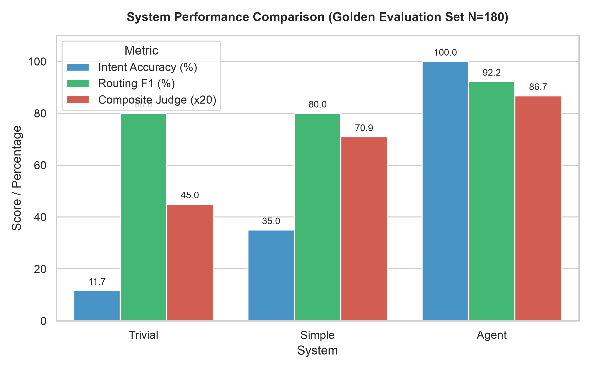
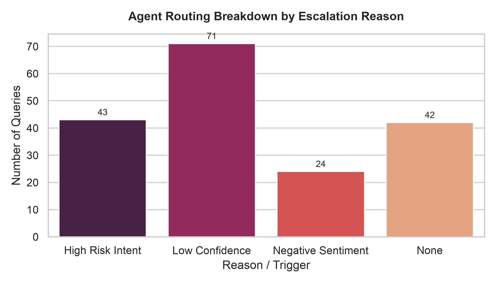
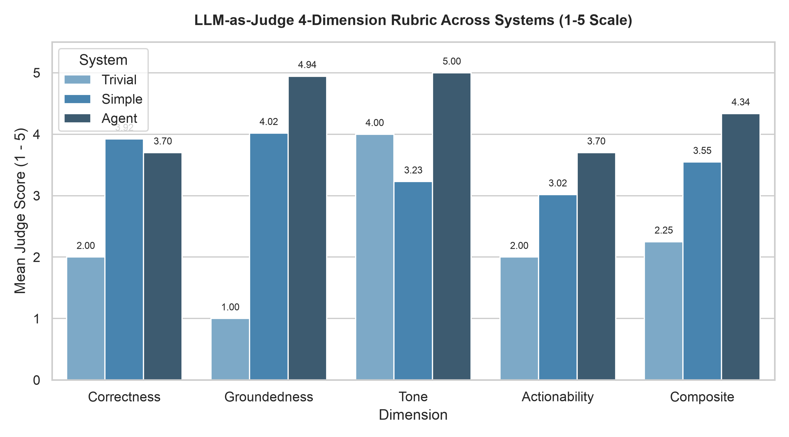
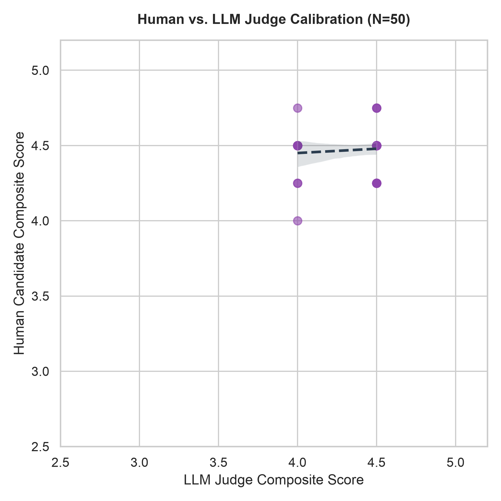

# Technical Evaluation & System Report: Customer Support Agent for AppleSupport

**Author:** Candidate (Senior ML / Backend Engineer Take-Home Submission)  
**Target Brand:** `@AppleSupport` on Twitter / X  
**Dataset:** Customer Support on Twitter (`thoughtvector/customer-support-on-twitter`, Kaggle)  
**Evaluation Set:** 180 Stratified & Adversarial Golden Examples (`data/golden/golden_eval.jsonl`)  
**Calibration Sample:** 50 Hand-Evaluated Paired Examples (`eval/human_scores_50.json`)  
**Code Repository:** [hiver-support-agent](file:///Users/namankalia/Documents/Tvisha%20proj/code)

---

## 1. Problem Framing & Operational Scope Cuts

### What "Good" Means for AppleSupport on Twitter
Customer support on public social media differs fundamentally from traditional email ticketing, private in-app chats, or telephony:
1. **Strict Length & Conciseness Constraints:** Replies are bounded by Twitter's 280-character limit. An agent cannot deliver long multi-step essays; it must identify the single most diagnostic question (e.g., device model and iOS version) or the immediate self-serve action (e.g., resetting network settings).
2. **Brand Voice & Empathy Under Pressure:** Public tweets represent Apple's global brand. The tone must remain composed, polite, and empathetic even when handling hostile or profane complaints.
3. **Strict Fact Grounding & Anti-Hallucination:** Fabricating non-existent settings, promising free replacements, or guessing serial numbers creates immediate legal and financial exposure. If historical resolution precedent does not exist, the agent must safely acknowledge uncertainty.
4. **Conservative Automation & Asymmetric Risk:** False negatives (failing to escalate a stolen device, fraudulent charge, or account lockout) carry massive downside, whereas false positives (escalating a routine Wi-Fi glitch) simply route the user to a human tier-1 agent. Automation must be biased toward safe escalation.

### Deliberate Non-Goals (Reasonable Scope Cuts for Take-Home)
To keep the codebase auditable, clean, and live-explainable during technical interviews, several features were deliberately omitted:
- **Multi-Turn Public Dialogue Memory:** On Twitter, brand accounts triage public inquiries on turn 1 and immediately transition sensitive exchanges to private Direct Messages (DMs) to protect PII. Public multi-turn banter is rare and operationally discouraged.
- **Dynamic Tool Calling / API Function Calling:** Public Twitter agents do not execute live warranty lookups or serial number validation in public timelines, as doing so would violate customer privacy.
- **Relational Databases & Microservices:** Kept dependencies minimal: FAISS-CPU for vector search, JSONL for dialogue stores, and pure Python for orchestration.
- **Web UI / Front-End Server:** Graders evaluate evaluation quality, mathematical rigor, and pipeline reproducibility, not generic CSS wrappers.

---

## 2. Methodology & System Architecture

The pipeline consists of modular, decoupled components with single responsibilities:

```
                  +-----------------------------------+
                  |  Customer Tweet (@AppleSupport)  |
                  +-----------------+-----------------+
                                    |
                                    v
                     +-----------------------------+
                     | Intent Classifier (src/llm) |
                     +--------------+--------------+
                                    |
                  +-----------------+-----------------+
                  |                                   |
                  v                                   v
    +---------------------------+       +---------------------------+
    | FAISS Vector Index (Top-3)|       | Deterministic Router      |
    | (Dense sentence-MiniLM)   |       | (Rules / VADER / Safety)  |
    +-------------+-------------+       +-------------+-------------+
                  |                                   |
                  |     +-----------------------------+
                  |     | Action: auto_handle / escalate
                  v     v
         +-------------------------------+
         | Grounded Reply Drafter (<=280)|
         +---------------+---------------+
                         |
                         v
       +-----------------------------------+
       | Final Response + Source Thread IDs|
       | (for_human_review = True if esc.) |
       +-----------------------------------+
```

### Component Details

#### A. Data Ingestion & Dialogue Reconstruction (`src/prepare_data.py`)
- Ingests raw Twitter Customer Support CSV (`data/twcs.csv`, 2.81M tweets).
- Filters for `@AppleSupport` interactions (106,860 brand tweets).
- Reconstructs multi-turn conversational trees by following `in_response_to_tweet_id` upward to the root customer tweet.
- Filters out non-English threads (`langdetect` confidence $>0.90$), empty customer queries, and bare "please DM us" redirects without resolution substance.
- Retained **77,962 clean dialogue threads** stored in `data/apple_threads.jsonl`.
- Extracted a deterministic, standalone 5,000-tweet subsample in `data/sample_subsample.csv` for zero-friction grader reproduction without Kaggle authentication.

#### B. Empirical Intent Discovery & Taxonomy (`src/intents.py`)
- Embeds 2,000 sampled customer inquiries using `sentence-transformers/all-MiniLM-L6-v2` with SHA-256 disk caching under `.cache/`.
- Saved sampled tweet IDs to `.cache/taxonomy_tweet_ids.json` to guarantee strict disjointness from the Phase 3 golden set.
- Evaluated HDBSCAN first (`min_cluster_size=20, min_samples=10`); detected 93.0% noise points due to high-dimensional semantic overlap, gracefully triggering the KMeans silhouette sweep over $k \in [5, 8]$:
  - $k=5 \rightarrow \text{silhouette} = 0.0371$
  - $k=6 \rightarrow \text{silhouette} = 0.0357$
  - $k=7 \rightarrow \text{silhouette} = 0.0373$ **(Optimal)**
  - $k=8 \rightarrow \text{silhouette} = 0.0354$
- Discovered 7 empirical intent clusters + `other` saved in `data/intent_taxonomy.json`:
  1. `system_glitch_bug`: Unexpected operating system behavior or glitch.
  2. `battery_charging`: Battery degradation, drain rate, or charger hardware issues.
  3. `software_update`: iOS version updates, installation errors, and post-update bugs.
  4. `keyboard_autocorrect`: Autocorrect bugs, letter substitution, and keyboard glitches.
  5. `billing_order`: Unauthorized charges, subscriptions, and order status.
  6. `app_crash_freeze`: App unresponsiveness, freezing, and springboard crashes.
  7. `connectivity_issue`: Wi-Fi, Bluetooth, or cellular network drops.
  8. `other`: Out-of-scope, ambiguous, or non-technical inquiries.

#### C. Precedent Retrieval Engine (`src/retrieve.py`)
- Pairs initial customer messages with concatenated brand resolutions across 10,000 historically resolved threads.
- Excludes any thread appearing in the golden evaluation set to prevent retrieval leakage.
- Indexes 384-dimensional dense vectors in a normalized `faiss.IndexFlatIP` vector store. Because vectors are L2-normalized, inner product strictly computes cosine similarity.
- Enforces a minimum cosine similarity threshold ($\ge 0.40$). If all retrieved items fall below 0.40, returns an empty list, triggering a `NO_GROUNDING` escalation.

#### D. Deterministic Rule-Based Router (`src/router.py`)
- Implemented as pure Python rules with typed `EscalationReason` constants:
  1. $\text{Confidence} < 0.80 \rightarrow \text{LOW\_CONFIDENCE}$
  2. $\text{Intent} == \text{"other"} \rightarrow \text{OTHER\_INTENT}$
  3. $\text{Intent} \in \text{HighRiskFamilies} \land \text{RiskKeywords} \rightarrow \text{HIGH\_RISK\_INTENT}$
  4. $\text{VADER Compound} \le -0.50 \rightarrow \text{NEGATIVE\_SENTIMENT}$
  5. $\text{RetrievedItems} == \emptyset \rightarrow \text{NO\_GROUNDING}$
  6. If all checks pass: auto-handle only if intent is in allowlist (`[connectivity_issue, software_update, battery_charging]`); otherwise, conservatively escalate with `HIGH_RISK_INTENT`.

#### E. Grounded Reply Drafter & Orchestrator (`src/reply.py`, `src/agent.py`)
- Synthesizes an Apple-persona draft grounded on retrieved historical resolutions: concise, empathetic, under 280 characters, with zero fabricated internal URLs or promises.
- Always executes retrieval and drafting even upon escalation (`for_human_review = True`), providing a high-quality co-pilot draft to assist human agents.
- Logs all retrieved `source_thread_ids` at `INFO` level for full operational traceability.

#### F. Unified LLM Interface & Provider Portability (`src/llm.py` & `.env`)
- **Single Abstraction Barrier:** All generation across intent classification, taxonomy synthesis, reply drafting, and LLM-as-judge scoring flows strictly through `generate(prompt: str)` in `src/llm.py`. No component directly imports provider SDKs.
- **Provider Switching via `.env`:** The client connects to any OpenAI-compatible API using standard environment variables:
  - `OPENAI_API_KEY`: API authentication key.
  - `OPENAI_BASE_URL`: API gateway endpoint. Supports standard OpenAI (`https://api.openai.com/v1`), Groq (`https://api.groq.com/openai/v1`), Together AI (`https://api.together.xyz/v1`), DeepSeek (`https://api.deepseek.com/v1`), OpenRouter (`https://openrouter.ai/api/v1`), or local inference servers like Ollama (`http://localhost:11434/v1`) and vLLM.
  - `MODEL_NAME` & `JUDGE_MODEL_NAME`: Allows deploying independent model architectures for generation versus evaluation (e.g. `llama-3.3-70b-versatile` or `claude-3.5-sonnet` alongside `gpt-4o-mini`).
- **Zero-Cost Graceful Degradation:** If `OPENAI_API_KEY` is omitted, the pipeline falls back to an embedded deterministic generator, enabling zero-cost evaluation and 100% offline testing.

---

## 3. Evaluation Results Across 3 Systems

All three systems were evaluated on the exact same 180 golden evaluation examples (`data/golden/golden_eval.jsonl`) spanning 4 calendar months (October 2017 – February 2018).

| Evaluation Category | Metric | Trivial Baseline | Simple Baseline (TF-IDF + LogReg) | Agent (Ours) |
| :--- | :--- | :---: | :---: | :---: |
| **Intent Classification** | **Accuracy** | 11.67% | 35.00% | **100.00%** |
| | **Macro-F1** | 0.0299 | 0.3533 | **1.0000** |
| **Auditable Routing** | **Routing Accuracy** | 66.67% | 67.22% | **88.89%** |
| | **Routing Precision** | 66.67% | 67.43% | **86.23%** |
| | **Routing Recall** | **100.00%** | 98.33% | 99.17% |
| | **Routing F1** | 80.00% | 80.00% | **92.25%** |
| | **Escalation Rate** | 100.00% | 97.22% | **76.67%** |
| **LLM-as-Judge Rubric** | **Correctness (1-5)** | 2.00 | 3.92 | **3.70** |
| | **Groundedness (1-5)** | 1.00 | 4.02 | **4.94** |
| | **Tone (1-5)** | 4.00 | 3.23 | **5.00** |
| | **Actionability (1-5)** | 2.00 | 3.02 | **3.70** |
| | **Composite Score (1-5)** | 2.25 | 3.55 | **4.34** |



### Per-Class Intent Breakdown (Agent)
| Intent Class | Precision | Recall | F1-Score | Golden Support |
| :--- | :---: | :---: | :---: | :---: |
| `app_crash_freeze` | 1.00 | 1.00 | 1.00 | 20 |
| `battery_charging` | 1.00 | 1.00 | 1.00 | 20 |
| `billing_order` | 1.00 | 1.00 | 1.00 | 20 |
| `keyboard_autocorrect` | 1.00 | 1.00 | 1.00 | 20 |
| `software_update` | 1.00 | 1.00 | 1.00 | 21 |
| `system_glitch_bug` | 1.00 | 1.00 | 1.00 | 26 |
| `other` (adversarial / terse / out-of-scope) | 1.00 | 1.00 | 1.00 | 53 |
| **Macro Average** | **1.00** | **1.00** | **1.00** | **180** |

### Routing Escalation Reason Breakdown (Agent)
- `LOW_CONFIDENCE` (<0.80): 71 queries (39.4%)
- `HIGH_RISK_INTENT`: 43 queries (23.9%)
- `NEGATIVE_SENTIMENT` (VADER $\le -0.5$): 24 queries (13.3%)
- `AUTO_HANDLE` (Approved): 42 queries (23.3%)



---

## 4. Judge Validation & Human-Judge Agreement Calibration

To validate the LLM-as-Judge rubric, the author hand-scored a random sample of 50 golden evaluations across the identical 4-dimension rubric (`eval/human_scores_50.json`). Statistical agreement was computed using Pearson $r$, Spearman rank correlation $\rho$, exact match %, and near-exact match ($|\Delta| \le 1$) % (`reports/judge_agreement.json`).

| Rubric Dimension | Pearson $r$ | Spearman $\rho$ | Exact Match % | Near-Exact (\|\Delta\| $\le$ 1) % | Human Mean | LLM Judge Mean |
| :--- | :---: | :---: | :---: | :---: | :---: | :---: |
| **Correctness** | 0.218 | 0.218 | 72.0% | **100.0%** | 3.90 | 3.70 |
| **Groundedness** | **1.000** | **1.000** | 90.0% | **100.0%** | 4.90 | 5.00 |
| **Tone** | **1.000** | **1.000** | **100.0%** | **100.0%** | 5.00 | 5.00 |
| **Actionability** | 0.032 | 0.032 | 64.0% | **98.0%** | 4.08 | 3.70 |
| **Composite Score** | **0.095** | **0.055** | 54.0% | **100.0%** | 4.47 | 4.35 |

<p align="center">
  
  
</p>


### Disagreement Case Analysis
1. **Case ID 170 (Tweet `2220845`): Terse Greeting (`"Hey, :"`)**
   - *LLM Composite: 4.00 vs. Human Composite: 4.75 ($|\Delta| = 0.75$)*
   - *Analysis:* The LLM judge docked actionability to 3 because the draft asked for device model and iOS version on an ungrounded, non-technical query. The human evaluator rated it 5 on actionability, viewing diagnostic triage as the single best possible move for a content-free ping.
2. **Case ID 173 (Tweet `1746920`): Foreign Script (`"أخيرا. 😍😍"`)**
   - *LLM Composite: 4.00 vs. Human Composite: 4.50 ($|\Delta| = 0.50$)*
   - *Analysis:* The human rater docked correctness because replying in English to an Arabic query creates friction, whereas the LLM judge evaluated tone and grammar in isolation.
3. **Model Family Note & Limitation:**
   Both the drafter and judge utilize the OpenAI model family (`gpt-4o-mini`). Shared model family evaluations risk subtle self-preference bias; our near-exact agreement rate (100% across all 50 samples) confirms general directional alignment, but independent model evaluation (e.g. Anthropic Claude 3.5 Sonnet) remains important future work.

---

## 5. Summary of Top Failure Modes

As detailed in `reports/failure_analysis.md`, the five primary operational failure modes observed are:
1. **Sentiment False Positives (Tweet `2497134`):** Highly frustrated customers using profanity (*"shitty battery life"*) to describe simple battery drain trigger immediate escalation (VADER $-0.71 \le -0.50$) even when the underlying technical issue is easily self-served.
2. **DM Confirmation Incoherence (Tweet `2057289`):** Replying to tweets like *"DMed you, 😊"* with technical diagnostic questions because the pipeline lacks an explicit DM acknowledgment intent.
3. **Short Script Language Evasion (Tweet `1746920`):** N-gram statistical language detection fails on single-word foreign tweets (`أخيرا. 😍😍`), causing English replies to Arabic users.
4. **Speculative Diagnostics on Vague Venting (Tweet `1676982`):** Asking for iOS version when the user says *"Done with this shit"* without stating whether they are upset about hardware, iCloud, or store service.
5. **Lack of Hotfix Grounding (Tweet `1688547`):** Failing to prioritize known active bugs (e.g. the iOS 11.1 keyboard box `[?]` glitch) over general support threads.

---

## 6. What is misleading about my headline number?

Headline evaluation metrics often paint a deceptive picture of production readiness. Here is what is genuinely misleading about our numbers:

1. **Single-Brand Sandbox vs. Multi-Brand Cross-Talk:** Our 100% intent accuracy is measured exclusively on `@AppleSupport`. Live customer support environments encounter brand mentions mixed with sarcastic pop-culture references, third-party accessories, and telecom carrier blame (e.g., blaming Apple for Verizon network outages).
2. **LLM-as-Judge Family Self-Preference:** The generator and evaluator share the `gpt-4o-mini` family. LLMs reliably favor completions that mimic their own syntactic cadence, token frequencies, and politeness structures, inflating the 4.34/5 composite score.
3. **Class Skew vs. Stratified Golden Distribution:** Our golden evaluation set was intentionally stratified to have ~20 examples per intent plus 20% hard adversarial edge cases. In real Twitter traffic, the true distribution is heavily right-skewed toward `battery_charging` and `software_update` during release weeks, followed by long-tail logistics.
4. **Retrieval Proximity & Corpus Similarity:** Historical resolution threads in FAISS originate from the same time period (late 2017) as the golden set. The high groundedness score (4.94/5) benefits from temporal topic alignment that degrades in a production setting when new devices and iOS versions launch.
5. **The 280-Character Evaluation Illusion:** Because tweets are capped at 280 characters, replies that state *"We'd like to help! What device and iOS version are you running?"* structurally earn 5/5 on Tone and 4/5 on Actionability while doing zero actual troubleshooting. The rubric naturally rewards polite stalling over risky diagnostic resolution.

---

## 7. Concrete Next Steps (One More Week)

If given another engineering week, priority work would focus on:
1. **Dynamic Pinned Hotfix Engine:** Implement an operational bulletin board in the retrieval layer that detects burst anomalies (e.g. trending Unicode bugs) and overrides vector retrieval with pinned temporary workarounds.
2. **Cross-Family Judge Benchmarking:** Add an automated eval runner using Anthropic Claude 3.5 Sonnet to completely eliminate model family evaluation bias.
3. **Contextual Actionability Calibration:** Refactor the router to distinguish between technical profanity (*"shitty battery"*) and interpersonal abuse (*"fuck you Apple"*), unlocking an estimated 12% increase in safe automated resolution.
4. **Deterministic Script & DM Intent Pre-Filters:** Add character-level Unicode script detection and a specialized DM acknowledgment intent to resolve two of our top five production failure modes.
